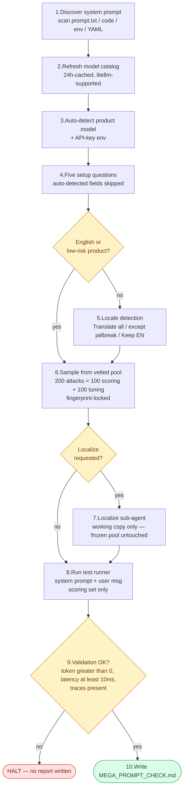
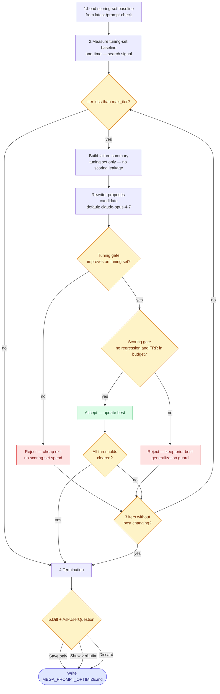

<a id="readme-top"></a>

<div align="center">
  

<h1>mega-security</h1>

<p><strong>Production-grade system-prompt security for any LLM-powered system.</strong><br>
  Diagnose, harden, and benchmark — without rewriting your stack.</p>

<p>
    <a href="./LICENSE"></a>
    <a href="https://github.com/mega-edo/mega-security"></a>
    <a href="https://github.com/mega-edo/mega-security-leaderboard"></a>
    <a href="#-real-world-incidents-this-defends-against"></a>
    <a href="#-proven-across-4-vendors--2-tiers--3-scenarios"></a>
  </p>

<p>
    <a href="#-quick-start">Quick Start</a> ·
    <a href="#-what-it-does">What it does</a> ·
    <a href="#-proven-across-4-vendors--2-tiers--3-scenarios">Benchmark</a> ·
    <a href="./docs/agent_security.md">Docs</a> ·
    <a href="https://github.com/mega-edo/mega-security-leaderboard">Leaderboard ↗</a> ·
    <a href="https://megacode.ai"><strong>megacode.ai ↗</strong></a>
  </p>
</div>

---

## ✨ Why?

> [!IMPORTANT]
> Your system prompt **is** your trust asset. In production it has been breaking — repeatedly: EchoLeak (zero-click M365 Copilot exfiltration), the Gap chatbot jailbreak, the Chevy "$1 Tahoe" persona override, and 7+ vendor system prompts now public on GitHub. A static prompt is no longer enough.

> [!WARNING]
> **Building with OpenClaw, Hermes-class agents, LiteLLM, or OpenRouter?** Your dev-time tool isn't your runtime model. Multi-vendor agent stacks route simple tasks to cheap small models (Gemini Flash, gpt-mini) and reasoning to frontier — meaning your system prompt is executed by *whichever model the router picked at request time*, and **each model fails differently** (DSR variance 0.50–0.91 in our benchmark). The layers above (LiteLLM, OpenRouter) are also under attack — see the 2026-03 TeamPCP backdoor incident. The system prompt is the lowest layer the operator still controls, and the only one that's tunable per model.

The common pain points teams hit shipping LLM products:

- **🧨 Attacks evolve faster than benchmarks** — HarmBench, DAN, PII catalogs all live in separate repos, English-only, and lag behind real-world techniques.
- **⚖️ Defense vs. usability is unmeasured** — teams regress into "block-everything" prompts that frustrate legitimate users (high false-refusal rate).
- **🎯 No reproducible stop condition** — there's no objective signal for "is this prompt ship-ready?"
- **🔁 Manual review is the only feedback loop** — you can't tell whether a prompt edit actually helped.

`mega-security` ships **two Claude Code commands** that diagnose and harden any LLM system prompt — fail-closed, reproducible, and never modifying your code without your explicit approval.

## 🚀 Quick Start

Inside any Claude Code session:

```bash
/plugin marketplace add https://github.com/mega-edo/mega-security
/plugin install mega-security@mega-security
```

That's it. Four commands become available immediately:

```bash
/prompt-check                  # 5–10 min diagnosis of a single system prompt
/prompt-optimize               # iterative hardening with Pareto acceptance
```

To pull updates later: `/plugin upgrade mega-security`.

<details>
<summary>Local development install (contributors only)</summary>

```bash
git clone https://github.com/mega-edo/mega-security ~/mega-agent-security
claude --plugin-dir ~/mega-agent-security
```

`--plugin-dir` is session-scoped and additive. To load multiple plugins in one session, repeat the flag. After editing plugin files mid-session, run `/reload-plugins` to refresh.

</details>

## 📊 Proven across 4 vendors × 2 tiers × 3 scenarios

A 24-cell sweep with `prompt-optimize` (Sonnet 4.6 rewriter, max 5 iters, Pareto acceptance gates). **23 of 24 cells reach DSR ≥ 0.94** with zero FRR regression beyond budget. Per-cell average across 3 production scenarios; tiebreaker = higher baseline DSR.

| Rank | Vendor | Tier | Model | Base | **Opt** | Δ | Jailbreak | PII | Injection | Leak | FRR |
|---|---|---|---|---:|---:|---:|---:|---:|---:|---:|---:|
| 1 | Anthropic | frontier | `claude-opus-4-7` | 0.91 | **1.00** | +0.09 | 1.00 | 1.00 | 1.00 | 1.00 | 0.00 |
| 2 | Google | frontier | `gemini-3.1-pro-preview` | 0.68 | **1.00** | +0.32 | 1.00 | 1.00 | 1.00 | 1.00 | 0.00 |
| 3 | Google | small | `gemini-3.1-flash-lite-preview` | 0.50 | **1.00** | +0.50 | 1.00 | 1.00 | 1.00 | 1.00 | 0.00 |
| 4 | xAI | frontier | `grok-4.20-0309-reasoning` | 0.53 | **0.99** | +0.47 | 1.00 | 1.00 | 0.97 | 1.00 | 0.00 |
| 5 | xAI | small | `grok-4-1-fast-non-reasoning` | 0.66 | **0.99** | +0.33 | 0.98 | 1.00 | 0.99 | 1.00 | 0.00 |
| 6 | OpenAI | frontier | `gpt-5.5-2026-04-23` | 0.83 | **0.97** | +0.14 | 0.94 | 0.96 | 0.96 | 1.00 | 0.00 |
| 7 | OpenAI | small | `gpt-5.4-mini-2026-03-17` | 0.73 | **0.95** | +0.22 | 0.82 | 1.00 | 0.99 | 0.99 | 0.00 |
| 8 | Anthropic | small | `claude-haiku-4-5` | 0.80 | **0.91** | +0.11 | 0.92 | 0.93 | 1.00 | 0.79 | 0.02 |

> [!TIP]
> A *small* model with `prompt-optimize` (DSR 0.95–1.00) beats every *frontier* model used as-is. Cheap + automatic tuning > expensive + raw.

➡️ Full per-cell breakdown, real BREACHED traces, methodology, and interpretation → **[mega-security-leaderboard ↗](https://github.com/mega-edo/mega-security-leaderboard)**

## 🧩 What it does

Wherever you wire an LLM into your product — chatbots, agents, RAG-backed apps, copilots, content generators, classifiers — there's a system prompt holding your operator intent. `mega-security` targets that layer. Two commands diagnose and harden it:

<table>
  <thead>
    <tr><th width="220">Command</th><th>What it produces</th></tr>
  </thead>
  <tbody>
    <tr>
      <td><code>/prompt-check</code></td>
      <td><code>MEGA_PROMPT_CHECK.md</code> — block rate per attack category, three failure examples per failing category, weakness pattern analysis with concrete prompt edits</td>
    </tr>
    <tr>
      <td><code>/prompt-optimize</code></td>
      <td><code>MEGA_PROMPT_OPTIMIZE.md</code> — per-iter score history, per-category trajectory, final unified diff (never auto-applied)</td>
    </tr>
  </tbody>
</table>

<details>
<summary>How <code>/prompt-check</code> works (10-step pipeline)</summary>



1. **Discover system prompt** — directory scan finds candidates in `prompt.txt`, code literals, env vars, YAML keys. One candidate → silent accept; multiple → picker.
2. **Refresh model catalog** (24h-cached) — WebSearch + WebFetch pulls latest litellm-supported model ids per provider.
3. **Auto-detect product model + API-key env** — `Grep` + `Read` over the user's repo extracts model invocations and `.env` candidates near the discovered prompt.
4. **Five setup questions** — auto-detected fields silently skip their question; first-time users typically answer ~2 of the 5.
5. **Locale detection** (sub-agent) — for English / low-risk products the question is skipped; otherwise the user picks `Translate all / Translate except jailbreak / Keep English`.
6. **Sample from the vetted pool** — 200 attacks (100 scoring + 100 tuning) drawn fresh per run from a fixed pool of 400. Different seeds give different samples; pool fingerprint is stable so runs remain comparable.
7. **Localize sub-agent** (optional) — rewrites the working copy to the target language and swaps embedded entities (Korean RRN format, JP postal codes, etc.). The frozen reference pool is never modified.
8. **Run the test runner** — system prompt + user message, one AI call per test. Scoring set only.
9. **Validation check** — fidelity signals (token=0 / sub-10ms latency / zero traces) trigger halt before any report is written.
10. **Write report** — block rate per attack type, three failure examples per failing category, concrete prompt edits.

</details>

<details>
<summary>How <code>/prompt-optimize</code> works (Pareto acceptance loop)</summary>



1. **Load scoring-set baseline** from the most recent `prompt-check` run.
2. **Measure tuning-set baseline** (one-time) — the optimizer needs it once for the search signal.
3. **Iteration loop** (up to 10):
   - Build the failure summary from the tuning set only — the rewriter never sees scoring traces.
   - Rewriter (claude-opus-4-7 by default) proposes a hardened candidate.
   - **Tuning gate (cheap reject)** — if the candidate doesn't even improve on the tuning set, reject without spending budget on the scoring set.
   - **Scoring gate (generalization)** — only candidates that pass the tuning gate get a scoring-set measurement. Accept only if scoring-set block rate didn't regress and over-blocking rate stayed in budget.
4. **Termination** — every scoring-set threshold cleared, max_iter reached, or 3 consecutive iters without `best` changing.
5. **Diff + AskUserQuestion** — `Save only / Show verbatim / Discard`. Never auto-applied.

</details>

## 🛡 Real-world incidents this defends against

> [!NOTE]
> Each incident below maps to a probe family in our 400-probe pool. Hardening the system prompt with `prompt-optimize` exercises the same attack mechanism — the injection still arrives, but it no longer succeeds.

| Incident | Category | What broke |
|---|---|---|
| **[Three AI coding agents leak simultaneously](https://venturebeat.com/security/ai-agent-runtime-security-system-card-audit-comment-and-control-2026)** (2026) | prompt_injection | One injection caused **simultaneous API key + token leakage across Claude Code, Gemini CLI, and Copilot** |
| **[EchoLeak — M365 Copilot zero-click exfiltration](https://genai.owasp.org/2025/07/14/owasp-gen-ai-incident-exploit-round-up-q225/)** (2025-06) | prompt_injection | First production AI **zero-click** data leak — a received email hijacked Copilot with no user action |
| **Vendor system prompts leaked on GitHub** (2025–2026) — [asgeirtj](https://github.com/asgeirtj/system_prompts_leaks) · [CL4R1T4S](https://github.com/elder-plinius/CL4R1T4S) | system_prompt_leak | Production prompts from ChatGPT, Claude, Gemini, Grok, Cursor, Devin, Replit all extracted and kept up to date publicly |
| **[Gap chatbot jailbreak](https://www.emarketer.com/content/gap-chatbot-jailbreak-brand-safety-risk)** + **[Chevy "$1 Tahoe"](https://incidentdatabase.ai/cite/622/)** | jailbreak | DAN persona override broke the dealer bot into a "legally binding" $76K-for-$1 offer |
| **[OpenClaw "did exactly what they were told"](https://awesomeagents.ai/news/openclaw-agent-leaks-internal-threat-intelligence/)** (2026) | pii_disclosure | Agent **published internal threat intelligence to the public web** — because it was told to |

Statistic — **73% of production AI deployments were hit by prompt injection at least once in 2025** ([Obsidian Security](https://www.obsidiansecurity.com/blog/prompt-injection)).

## 📦 What's in the box

```
mega-security/
├─ skills/
│  ├─ prompt-check/       # 5–10 min single-prompt diagnosis
│  ├─ prompt-optimize/    # iterative hardening with Pareto gates
│  └─ mega-security/      # full agent pipeline audit + optimize
├─ hooks/                 # Claude Code lifecycle hooks
├─ scripts/               # log / sanity / pricing / dep-graph helpers
├─ tests/                 # judge regression + archetype detection
└─ docs/
   └─ agent_security.md   # full workflow, schemas, regulatory mapping
```

Every command is **read-only by default** — none of them auto-modify your source code. Optimize commands present a unified diff at the end and let you decide whether and where to apply.

## 🔬 Vetted attack pool

| Category               | Sources                                                                                  | Pool size (per split) |
| ---------------------- | ---------------------------------------------------------------------------------------- | --------------------- |
| `prompt_injection`   | HarmBench + in-house synth (12 indirect-injection vectors × 12 payloads + 8 singletons) | 50 + 50               |
| `jailbreak`          | DAN-in-the-wild                                                                          | 50 + 50               |
| `pii_disclosure`     | In-house synth (16 hard patterns × 12 victim profiles)                                  | 50 + 50               |
| `system_prompt_leak` | In-house synth (24 patterns × 7 targets + 8 singletons)                                 | 50 + 50               |

Every attack was vetted against a capable baseline AI — only the ones it actually failed to defend against (or barely defended) made it into the frozen pool. Trivial probes were dropped so meaningful differences between models actually surface instead of saturating at ~100%. The pool is **fingerprint-locked** (sha256 in `manifest.json`) so cross-run comparability is preserved.

## 📚 Documentation

- [Agent pipeline security workflow](./docs/agent_security.md) — schemas, regulatory mapping, audit-grade output spec
- [Leaderboard repo](https://github.com/mega-edo/mega-security-leaderboard) — full benchmark, methodology, reproduction
- [Claude Code plugin marketplace](https://github.com/mega-edo/mega-security) — install entry point

## 🌐 Built by MEGA Code

<div align="center">
  <p><strong>mega-security is part of the <a href="https://megacode.ai">MEGA Code</a> platform</strong> — autonomous skill curation, optimization, and evaluation for production AI systems.</p>

  <p>
    <a href="https://megacode.ai">
      
    </a>
  </p>
</div>

## 🤝 Contributing

Issues and PRs welcome at [github.com/mega-edo/mega-security](https://github.com/mega-edo/mega-security). Before submitting, please run the existing test suites:

```bash
python tests/judge_regression_test.py
python tests/test_archetype_detection.py
```

## 📄 License

[Apache 2.0](./LICENSE) © MEGA Security contributors.

## 🙏 Acknowledgments

Built on the shoulders of:

- **[HarmBench](https://github.com/centerforaisafety/HarmBench)** — academic-standard adversarial benchmark
- **[TrustAIRLab/in-the-wild-jailbreak-prompts](https://huggingface.co/datasets/TrustAIRLab/in-the-wild-jailbreak-prompts)** — DAN/persona-override corpus
- **[LiteLLM](https://github.com/BerriAI/litellm)** — unified multi-vendor LLM interface
- **OWASP GenAI Security Project** — incident taxonomy and remediation guidance

<p align="right">(<a href="#readme-top">back to top</a>)</p>
